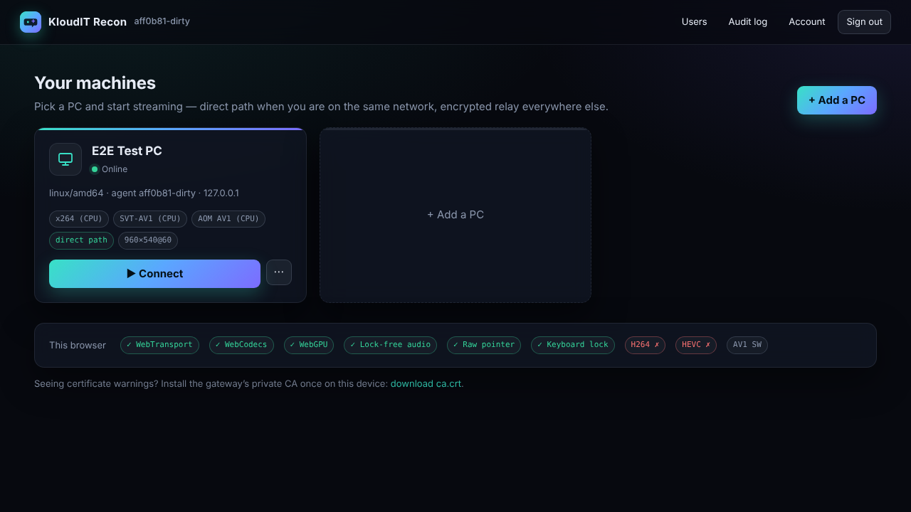
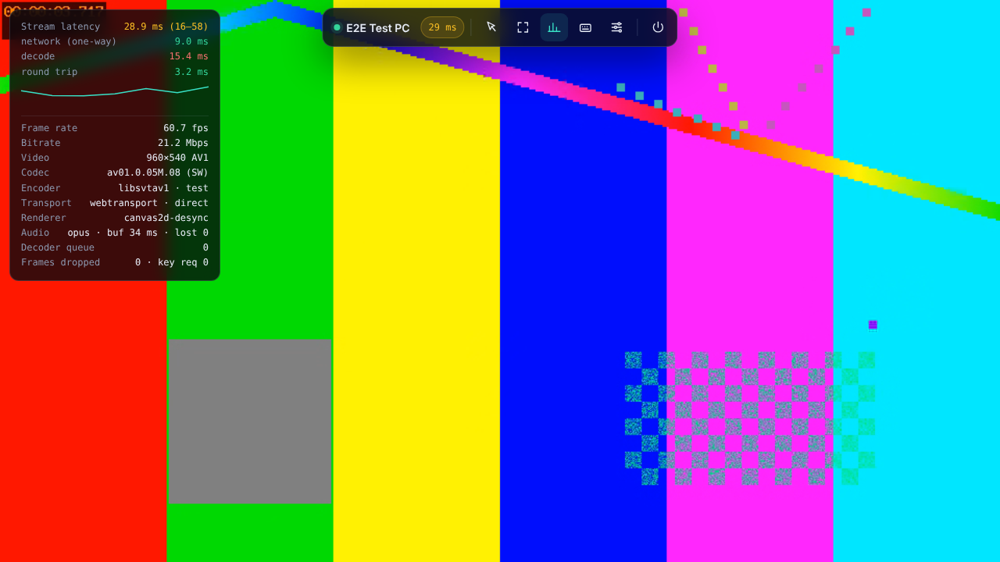

# KloudIT Recon

**Browser-native, ultra-low-latency remote play for your Windows gaming PC.**
No client app: open a tab on any device, sign in, and play. A tiny gateway on your
Proxmox server handles auth, Wake-on-LAN and relaying. A lightweight agent on the
PC captures the screen on the GPU, hardware-encodes it, and injects your input.



Think *Apache Guacamole, rebuilt for games*. Guacamole remotes desktops over
RDP/VNC; Recon streams a GPU-encoded game feed straight into the browser's
hardware decoder and sends input back over QUIC.

---

## What makes it different

| | Recon | Steam Remote Play / PS Remote Play | Parsec | Moonlight + Sunshine | Guacamole |
|---|---|---|---|---|---|
| Client | **any modern browser** | app | app | app | browser |
| Transport | **WebTransport / HTTP-3 QUIC**, WebSocket fallback | proprietary UDP | proprietary UDP | RTSP + ENet | WebSocket (TCP) |
| Video decode | **WebCodecs, hardware**, no media-element buffering | native | native | native | images / canvas |
| Self-hosted gateway with users, 2FA, audit | **yes** | no | no | no | yes |

Techniques used (most of them are new to browser-based game streaming):

- **One QUIC stream per video frame (WebTransport).** A lost packet only delays its own
  frame, never the frames behind it, unlike TCP/WebSocket or a single ordered stream.
  This is the design behind the IETF *Media over QUIC* work.
- **Zero-delay framing out of FFmpeg.** Raw H.264 has no frame boundaries, and the MP4/MKV
  muxers hold each frame until the next one exists (one full frame of added latency, measured
  during development). Recon reads FFmpeg's **NUT** container, which writes each packet with its exact
  size the moment it is encoded. The demuxer is verified byte-for-byte against `ffprobe` and
  proven not to read past a packet.
- **Zero-copy GPU capture → hardware encode.** DXGI Desktop Duplication (`ddagrab`) or
  Windows.Graphics.Capture (`gfxcapture`, which supports GPU downscaling and per-window
  capture) feeds D3D11 textures straight into NVENC / AMF / QSV. They are tuned for ultra-low
  latency: CBR with a 1–3-frame VBV, no B-frames, no lookahead, zero-latency mode, and each
  packet read out as soon as its frame is encoded.
- **Overlapped encoder restarts.** Changing bitrate, resolution, codec or display starts a new
  encoder *while the old one keeps streaming*, then switches on the new key frame. You get no freeze.
- **The entire media pipeline runs in a Worker.** WebTransport → reorder buffer → `VideoDecoder`
  (`optimizeForLatency`, at most 2 chunks queued, never flushed) → an **OffscreenCanvas** that
  draws each frame the instant it decodes and closes it at once. Three presentation paths: a
  **desynchronized** (front-buffer) 2D canvas, **WebGL2** (`texImage2D` of the frame) or
  **WebGPU `importExternalTexture`** zero-copy rendering; **Auto** tries them on the live stream
  the first time and keeps a pick for that browser (a heuristic: the desynchronized 2D canvas
  unless another path is clearly better; the latency rig decides). The canvas is sized to device
  pixels with nothing on top of it, so the compositor never scales or covers it. The main thread
  can't stall a frame. A startup self-test catches decoders that hold frames back and avoids them.
- **Direct path with certificate-hash pinning.** On your LAN the browser connects **straight to
  the PC** using WebTransport `serverCertificateHashes` (short-lived ECDSA certs, rotated
  automatically). Access requires a gateway-signed, single-use ticket that is bound to the page's
  origin. If the direct path fails, Recon falls back to the gateway relay, then to WebSocket.
- **Raw input with no lost motion.** `pointerrawupdate` plus Pointer Lock with
  `unadjustedMovement` gives raw mouse deltas. Mouse motion travels as unreliable datagrams that
  carry *running totals*, so a lost datagram only delays motion and never drops it. The host
  injects **scancodes** via SendInput, which works with DirectInput and raw-input games. In
  fullscreen, Keyboard Lock passes Esc, Alt+Tab and the Win key to the PC (Chrome and Edge; Safari
  26.4 keeps Esc for the PC through its fullscreen keyboard-lock option).
- **Zero-latency local cursor.** In desktop mode the host sends its real cursor shapes (arrow,
  I-beam, resize…) and your browser renders them natively, so the pointer never lags.
- **Lock-free audio.** System audio is captured with WASAPI loopback and encoded as Opus
  (CELT low-delay) in pure Go, so the PC needs no extra DLLs: 10 ms frames, 5 ms ones on a LAN
  (from the measured round-trip time) when the capture delivers audio at least every 5 ms
  (Windows' default 10 ms audio engine period does not, and smaller frames would then save
  nothing). It travels as datagrams, through `AudioDecoder`, a **SharedArrayBuffer** ring and an
  AudioWorklet whose jitter buffer adapts to the network (10–20 ms on a LAN, up to 60 ms on a
  jittery link; the pauses between sounds do not count) and trims drift.
- **Live latency readout.** NTP-style clock sync and per-frame host timestamps split every
  frame's *capture → on-screen* latency into capture/encode, host queue, network, transfer,
  reorder, decode, draw and display, with p50/p95/p99 per stage. A **latency probe** checks them
  from the picture: it reads a frame barcode (the test pattern's frame number, or the wall clock
  drawn by `tools/latency-test/index.html` on the PC) and builds a capture → drawn histogram you
  can export as JSON.
- **Self-protecting under load.** Delay-gradient congestion detection lowers the bitrate before
  queues build up, and the bitrate climbs back to your setting (15 % every 10 s) once the
  network is quiet again. A decoder backlog gets dropped and resynced from a fresh key frame, so
  latency can't grow without bound; the bitrate then climbs back only to 85 % of where the
  decoder fell behind.
- **No restarts for late frames.** Frames travel on reliable streams, so a gap in the sequence
  waits for the late frame instead of asking for a key frame. The host reports every frame it
  drops, and the client recovers at once: it skips the frame when the encoder heals the picture
  with intra refresh (NVENC H.264 and HEVC), otherwise it asks for a key frame.
- **Virtual Xbox controllers** through the ViGEmBus driver's IOCTL interface (no
  ViGEmClient.dll), fed by the browser Gamepad API at 250 Hz, with **rumble**: a game's force
  feedback comes back to your controller through the Gamepad API's `vibrationActuator`.



## Measured results

The browser end-to-end test (`test/e2e/browser.mjs`) runs the real gateway, the real host agent
and headless Chromium, and checks video, audio, input delivery and latency on every path. These
numbers come from CI-like conditions: **software** SVT-AV1 encoding and **software** AV1 decoding,
both competing for the same 4-core VM, 960×540 at 60 fps:

| Path | Encoder-out → on screen | Network (one-way) | Decode (software AV1) | FPS | Click → first frame |
|---|---|---|---|---|---|
| WebTransport, direct to PC | **17–27 ms** (typ. 20) | 6–10 ms | 8–13 ms | 60 | ~300 ms |
| WebTransport via gateway | **24–36 ms** (typ. 26) | 9–13 ms | 10–18 ms | 60 | ~300 ms |
| WebSocket via gateway | **19–46 ms** (typ. 23) | 6–10 ms | 10–30 ms | 60 | ~300 ms |

These are ranges across repeated runs. Decode time dominates the spread because the software decoder
competes with the software encoder for the same CPU.

These numbers are a worst case. On your PC, NVENC/AMF/QSV encode in a few milliseconds and the
browser decodes in hardware, with no CPU contention. The overlay shows your live numbers
(**Ctrl+Alt+Shift+S**).

---

## Architecture

```
 Browser (Chrome / Edge / Firefox / Safari 26.4+)
   main thread: UI, raw input, gamepads, AudioWorklet
   worker:      WebTransport ─► reorder ─► VideoDecoder ─► OffscreenCanvas (2D / WebGL2 / WebGPU)
        │   HTTPS (UI, API)            TCP 8443
        │   HTTP/3 WebTransport        UDP 8443  ── relay path
        │   WebSocket (fallback)       TCP 8443
        │
        │                ┌─────────────────────────────────────────────┐
        ├───────────────►│ recon-gateway  (Proxmox LXC, ~20 MB RAM)    │
        │                │ auth · 2FA · users · audit · Wake-on-LAN    │
        │                │ private CA · rotating WebTransport certs    │
        │                │ cut-through relay (QUIC↔QUIC, WS↔QUIC)      │
        │                └──────────────▲──────────────────────────────┘
        │                               │ QUIC tunnel, host dials out,
        │                               │ gateway identity pinned (SPKI)
        │   direct path (LAN):          │
        │   WebTransport UDP 47998      │
        │   cert-hash pinned, ticket    │
        ▼                               │
 ┌──────────────────────────────────────┴───────────────────────────┐
 │ recon-host  (Windows 11 gaming PC)                               │
 │ ffmpeg: ddagrab/gfxcapture ─(D3D11)─► NVENC/AMF/QSV ─► NUT ─► Go │
 │ WASAPI loopback ─► Opus (pure Go) ─► datagrams                   │
 │ SendInput (scancodes, raw rel/abs mouse) · cursor shapes · ViGEm │
 └──────────────────────────────────────────────────────────────────┘
```

Protocol and latency details: [docs/ARCHITECTURE.md](docs/ARCHITECTURE.md).
Security model: [docs/SECURITY.md](docs/SECURITY.md).
Test network profiles (lan, wifi, wan, capdrop): [docs/NETEM.md](docs/NETEM.md).

---

## Quick start

The full walkthrough, with every command, what success looks like and what to do when a step
fails, is in **[docs/INSTALL.md](docs/INSTALL.md)**. The short version:

### 0. Get the binaries

Every push builds release bundles in GitHub Actions. Sign in to GitHub, open **Actions → ci →**
the newest green run **→ Artifacts → `kloudit-recon-binaries`** (not `e2e-results`). The zip
contains:

- `kloudit-recon-<version>-gateway-linux-amd64.tar.gz`: the gateway and its install scripts
  (Proxmox nodes are amd64; the `-arm64` tarball is for ARM boards)
- `kloudit-recon-<version>-host-windows-amd64.zip`: the PC agent and its PowerShell installer
- `SHA256SUMS`

To build them yourself (needs Go 1.26+, `zip`; mingw-w64 and cmake for the optional
`recon-encoder.exe` helper): `make release`. The output goes to `dist/`.

### 1. Gateway on Proxmox (LXC)

Copy the gateway tarball to the Proxmox node **without extracting it on Windows** (that loses
the execute bits), for example from PowerShell on your PC:
`scp (Get-Item .\kloudit-recon-*-gateway-linux-amd64.tar.gz).Name root@<proxmox-ip>:/root/`.
Then, in the node's shell (web UI → your node → **>_ Shell**):

```bash
cd /root && tar xzf kloudit-recon-*-gateway-linux-amd64.tar.gz && cd gateway-linux-amd64
./create-lxc.sh --ctid 210 --ip 192.168.1.50/24,gw=192.168.1.1   # a free LAN address; or --ip dhcp
```

This creates a small unprivileged Debian 12 container (1 core, 512 MB) with the gateway
running as a hardened systemd service. It prints the URL and a **one-time setup token**.
Use a static IP (or a DHCP reservation): paired PCs remember the gateway's address.
Other options: `--storage`, `--bridge`, `--port`, `--name`; upgrade later with
`./create-lxc.sh --upgrade 210` from a newer bundle (settings are kept).

Other ways to install:
- **Existing LXC/VM** (Debian/Ubuntu): `sudo ./install-gateway.sh --binary ./recon-gateway`
- **Docker** (builds from source): `git clone https://github.com/karamkamal1/KloudIT-Recon.git &&
  cd KloudIT-Recon && docker compose -f deploy/docker/docker-compose.yml up -d --build` (host
  networking, so Wake-on-LAN broadcasts reach your LAN). The setup token is in
  `docker compose -f deploy/docker/docker-compose.yml logs`.

### 2. First login

Open `https://<gateway-ip>:8443` (with `https://`). The gateway uses its own private CA: accept
the warning once, or download **ca.crt** from the dashboard and install it as a trusted root on
your devices. Enter the setup token (it stays valid until used; it's also in
`/var/lib/kloudit-recon/setup-token.txt`, e.g. `pct exec 210 -- cat /var/lib/kloudit-recon/setup-token.txt`),
create your admin account, then enable 2FA under **Account**.

### 3. Add your gaming PC

Open the dashboard **from the gaming PC** using the gateway's LAN IP (the pairing code
remembers the address you browse with). Click **+ Add a PC**, give it a name, click
**Create pairing code**, then click **Copy**. Then, signed in to Windows as the user who plays, open **PowerShell as
administrator**, `cd` into the unzipped `host-windows-amd64` folder and paste the copied command:

```powershell
powershell -ExecutionPolicy Bypass -File .\install-host.ps1 -PairingCode "recon1:..." -InstallViGEm
```

The installer:
- downloads FFmpeg (an FFmpeg 8.1+ release build, SHA-256 verified)
- pairs the agent with your gateway
- registers a hidden **logon task** with highest privileges, so input reaches elevated games
- opens UDP 47998 for the direct path on Private networks only (it warns if your network is
  set to Public)
- installs ViGEmBus for controller support (`-InstallViGEm`)
- starts the agent and checks that it reaches the gateway, and warns if no GPU encoder works

The PC's card in the dashboard shows **Online** when the agent connects.

### 4. Play

Click **Connect**, then **Start streaming**. Click into the picture, press
**Ctrl+Alt+Shift+F** for fullscreen with keyboard lock, and **Ctrl+Alt+Shift+M** for game
(raw mouse) mode. Chrome or Edge give the best experience (keyboard lock, WebTransport).

---

## Using it

| Shortcut (Ctrl+Alt+Shift + …) | Action |
|---|---|
| **M** | Toggle mouse mode: *Desktop* (absolute pointer, local cursor) ↔ *Game* (pointer lock, raw relative input) |
| **F** | Fullscreen + Keyboard Lock (Esc / Alt+Tab / Win go to the PC; hold Esc to leave) |
| **S** | Performance overlay (latency breakdown, fps, bitrate, codec, path) |
| **O** | Settings drawer |
| **V** | Type text on the PC (paste passwords, chat) |
| **Q** | Disconnect |

**Settings** (applied live unless noted):
- **Codec**: Auto prefers hardware encode on the PC *and* hardware decode in your browser, and
  there HEVC (then AV1, then H.264), on AMD and NVIDIA PCs alike. While connecting, the browser
  times each codec's decoder on a short 1080p clip (overlay: "Decoder self-test … timed 1080p");
  a codec your browser decodes clearly faster replaces HEVC (H.264 only when it saves a lot, as
  it needs more bitrate for the same picture; AV1 only on PCs with `"av1": "faster"`). AV1 is
  available only where the PC's GPU encodes it (AMD RDNA3 and newer, NVIDIA RTX 40 and newer);
  RDNA3 uses it only at sizes in 64×16 steps (e.g. not 1920×1080).
- **Bitrate**: 50–150 Mbps on a LAN. Over the internet, stay below your upload speed.
- **Frame rate** (up to 240) and **resolution** (native, or downscaled on the GPU).
- **Encoder preset**: lowest latency / balanced / best quality.
- **Display**: pick a monitor on multi-monitor PCs.
- **Audio**: Opus or lossless PCM, plus the jitter buffer: *Auto* (default, adapts within
  10–60 ms) or *Fixed* at the size you set.
- **Network path, transport, renderer and decoder**: these apply on reconnect. Renderer
  *Auto* (default) tries the 2D canvas, WebGL2 and WebGPU on the live stream for about 10 s on
  the first connection in a browser and remembers its pick for that browser version: a path
  that fails draws, cannot keep the frame rate or holds the page's frames back is out, a
  desynchronized context comes first, and it leaves the 2D canvas only for a path that draws
  clearly faster in both rounds (overlay: per-path numbers and why; *Measure renderers again*
  repeats it). This is a heuristic: the browser cannot measure presentation itself. A picked
  path that stops drawing is dropped for the 2D canvas. Pick a renderer to override Auto, for
  example after measuring click-to-photon with the latency rig
  ([docs/LATENCY_RIG.md](docs/LATENCY_RIG.md)).
- **Frame pacing** (Pipeline): *Lowest latency* (default) draws each frame the moment it
  decodes. *Smooth* draws at most one new frame per display refresh, in the refresh's animation
  frame callback, for an even cadence; it costs up to one refresh of latency (the overlay's
  *hold* row) and drops a frame that missed its refresh when a newer one is already decoding.
- **Latency probe** (Diagnostics): open `tools/latency-test/index.html` (in the release zip:
  `latency-test\index.html`) full-screen on the streamed monitor of the PC; the overlay then shows
  host screen → drawn latency measured from the picture, and **Export latency data** saves it.

The stream pauses automatically when the tab is hidden, which frees your PC's GPU.

## Playing away from home

The best option is **Tailscale or WireGuard** to your home network. QUIC/UDP passes through
untouched, so you keep WebTransport and the direct path. Other options:

- **Port forwarding**: forward **TCP and UDP 8443** to the gateway. The account is protected by
  Argon2id, 2FA, rate limiting and lockout. Set `RECON_NAMES` to your domain and preferably use
  a real certificate (`-cert`/`-key`).
- **HTTP-only reverse proxies / tunnels** (e.g. Cloudflare Tunnel) carry only TCP. Recon
  detects this and falls back to WebSocket automatically. Pass the proxy's address with
  `-trust-proxy` so rate limiting sees real client IPs.

## Configuration

**Gateway** flags (environment variables in parentheses):

| Flag | Default | Meaning |
|---|---|---|
| `-listen` (`RECON_LISTEN`) | `:8443` | TCP (HTTPS/WSS) **and** UDP (HTTP/3, WebTransport, host tunnels) |
| `-data` (`RECON_DATA`) | `./data` | State, keys, audit log (`/var/lib/kloudit-recon` when installed) |
| `-name` (`RECON_NAMES`, comma-separated) | auto | Extra certificate names (domain, public IP); the container's IPs and hostname are always included |
| `-cert`/`-key` (`RECON_CERT`/`RECON_KEY`) | private CA | Use your own certificate |
| `-public-addr` (`RECON_PUBLIC_ADDR`) | request host | `host:port` the PCs dial (written into pairing codes; the listen port is added if missing) |
| `-trust-proxy` | none | CIDR of a reverse proxy whose `X-Forwarded-For` is trusted |

On a Linux/LXC install the settings live in `/etc/kloudit-recon/gateway.env` (one
`RECON_...=value` per line; `systemctl restart recon-gateway` after editing). Re-running the
installer keeps them.

Account recovery, as root on the gateway (in Proxmox: `pct enter 210`):

```bash
systemctl stop recon-gateway
recon-gateway -data /var/lib/kloudit-recon user passwd <name>     # or: user reset-2fa <name>
systemctl start recon-gateway
```

The new password (at least 10 characters) is read from stdin.

**Host** (`%APPDATA%\KlouditRecon\host.json`):

| Key | Default | Meaning |
|---|---|---|
| `capture` | `auto` | `auto` (gfxcapture when scaling or capturing a window, else ddagrab), `ddagrab`, `gfxcapture`, or `amf` (experimental: AMD Direct Capture through FFmpeg 8.1's `vsrc_amf`, which hands each present of the game or desktop to an AMD (`*_amf`) encoder as an AMF surface, with no conversion; never chosen by `auto`. The agent uses ddagrab instead when the encoder is not AMF, the video must carry the cursor (`drawCursor` or the client's video cursor), the monitor is not on the first GPU or is rotated, or AMD Direct Capture failed earlier in the session; host.log says why. Unverified on hardware: see `docs/VENDOR_NOTES.md`, 1.6) |
| `encoder` | auto | Force an encoder, e.g. `hevc_nvenc`, `av1_nvenc`, `h264_amf` |
| `av1` | `fallback` | When the automatic codec choice uses AV1 (on a GPU that encodes it): `fallback` only where HEVC does not work end-to-end (a browser without HEVC; then before H.264); `faster` also instead of HEVC for a browser that decodes AV1 clearly faster (at least 10 % and 0.5 ms per frame). Switch to `faster` after measuring this PC's AV1 encoder (latency overlay, image quality). The host log's `codec choice` line says what was chosen and why |
| `defaultKbps` / `maxKbps` | 30000 / 250000 | Bitrate defaults and cap |
| `defaultFps` / `maxFps` | 60 / 240 | Frame-rate default and cap (also capped at the display refresh rate) |
| `directPort` | 47998 | UDP port for the direct path (0 = relay only) |
| `directAddr` | auto | Address to advertise for the direct path |
| `congestion` | `reno` | QUIC congestion control of the host's video connections (direct path and the host → gateway relay data connection; the gateway → browser leg of a relay session stays `reno`): `reno` (quic-go default) or `media` (paces at 1.2 × the session's bitrate, video + audio + 200 kbit/s, and does not halve its window on a single loss; experimental) |
| `drawCursor` | false | Bake the cursor into the video instead of rendering it locally |
| `captureTimestamps` | auto | `off` stops stamping frames with their capture time (FFmpeg `setpts=time(0)*1000000`); the overlay then shows send→draw latency. With `capture` `amf` the FFmpeg chain keeps that wall-clock pts (`vsrc_amf`'s own pts are rounded to 1/fps), and `off` only stops sending capture stamps to the client |
| `gpuPriority` | `auto` | GPU scheduling priority of the FFmpeg capture/encode process, so it is not queued behind a game that keeps the GPU at ~100 %: `auto` (realtime; high when the encoder or the GPU is NVIDIA and hardware-accelerated GPU scheduling is on or cannot be determined, where realtime can freeze NVENC or hang the driver), `high`, `realtime` or `off`. Realtime needs the elevated agent (the logon task); a refused realtime falls back to high. The host log shows the result: `gpu priority: realtime`, `high` or `failed` |
| `audio`, `audioKbps`, `gamepad` | true, 160, true | Audio and controller support |
| `ffmpeg` | auto | Path to `ffmpeg.exe` (FFmpeg 8.1+ recommended: older builds lack `gfxcapture`, used for GPU downscaling and window capture) |

Edit `host.json` with Notepad, then restart the agent: `Stop-ScheduledTask 'KloudIT Recon Host'; Start-ScheduledTask 'KloudIT Recon Host'`.

Run `& "$env:ProgramFiles\KlouditRecon\recon-host.exe" probe` to see the FFmpeg version, the
detected encoders (and why any GPU encoder is unusable), capture backends, monitors and gamepad
support. Under each encoder it prints the exact FFmpeg command line the agent runs with that
encoder when a browser streams the first monitor at the default settings (native resolution,
60 fps, 30 Mbit/s, balanced quality, adaptive bitrate) under this `host.json`; an encoder that
heals lost frames with periodic intra refresh shows `intra-refresh=` after its name. The
`session:` line above it says how that session captures: with the default `"capture": "auto"`
that is ddagrab (other resolutions and window capture use gfxcapture). To try an encoder by hand,
open PowerShell in the folder of `ffmpeg.exe` (the `ffmpeg:` line) and paste its line as
`.\ffmpeg ...` with `pipe:1` replaced by `-stats -frames:v 600 -y $env:TEMP\test.nut`. ddagrab
only delivers a frame when the screen or the mouse pointer changes, so keep something moving
(move the mouse, play a video) until the `frame=` counter reaches 600. Flags go before the
command: `recon-host.exe -v probe`.

## Troubleshooting

- **The PC stays offline.** Look at `%APPDATA%\KlouditRecon\host.log`. `dial ...: timeout`
  means UDP 8443 from the PC to the gateway is blocked or the pairing code holds an address the PC
  can't reach (create codes while browsing via the gateway's LAN IP). `rejected registration`
  means the PC was re-paired: paste the new pairing command.
- **Video is choppy or latency is high, and the overlay shows a CPU encoder (x264/SVT-AV1).**
  No GPU encoder works. Run `probe` (above): the `unusable:` lines give the reason, usually an
  outdated GPU driver. Update it and restart the agent.
- **The browser always uses WebSocket.** UDP 8443 is blocked between the browser and the
  gateway, or your browser lacks WebTransport. Check your firewall, port forwarding or proxy.
- **The direct path is never used.** Allow UDP 47998 on the PC (the installer adds a
  Private-network rule; mark your network as *Private* in Windows). Some browsers ask for
  local-network access the first time.
- **Black screen in a game.** Use *borderless/windowed fullscreen*. Some old exclusive-fullscreen
  titles can't be duplicated.
- **The lock screen and UAC prompts aren't visible.** The agent runs in your desktop session and
  can't capture Windows' secure desktop. For headless use, enable automatic sign-in and set UAC to
  not dim the desktop.
- **No controller.** Install ViGEmBus (`install-host.ps1 -InstallViGEm`), then check
  `recon-host.exe probe`.
- **Choppy audio on Wi-Fi.** The *Auto* jitter buffer grows after each glitch (overlay: Audio
  row, underruns); if it still crackles, set it to *Fixed* at 40–60 ms.
- **Logs**: the PC writes `%APPDATA%\KlouditRecon\host.log`. On the gateway, run
  `journalctl -u recon-gateway -f` (from the Proxmox node: `pct exec 210 -- journalctl -u recon-gateway -n 50`). The browser's overlay (**Ctrl+Alt+Shift+S**) shows the
  active path, codec and latency breakdown.

## Limitations

- One active stream per PC. A new connection takes over, and the replaced browser does not
  reconnect automatically.
- The Windows secure desktop (lock screen, UAC) can't be captured (see above).
- No microphone passthrough or host → browser clipboard sync yet (you can type text into the PC).
- HDR streams are tone-mapped to SDR by the capture API.

## Development

Repository layout:

| Path | Contents |
|---|---|
| `cmd/recon-gateway`, `cmd/recon-host` | The two programs' entry points |
| `internal/gateway` | Web server, accounts/2FA, API, relay, Wake-on-LAN, TLS |
| `internal/host` | PC agent: sessions, direct path, gateway tunnel; `media/` (FFmpeg, audio), `input/` (SendInput), `platform/` (monitors, cursor, ViGEm) |
| `internal/proto`, `internal/transport`, `internal/nut`, `internal/codec` | Wire protocol, QUIC/WebTransport adapters (`transport/cc`: media congestion controller), NUT demuxer, codec strings |
| `third_party/quic-go` | quic-go with a pluggable congestion-control hook (`go.mod` replace; see `third_party/README.md`) |
| `internal/auth`, `internal/tlsutil` | Password hashing, TOTP, tickets; CA and certificate handling |
| `web/static` | Browser client (`js/stream-worker.js` is the decode/render pipeline) |
| `native/recon-encoder`, `internal/host/encoder` | Native capture/encode helper (C++, in progress) and its Go client; see `docs/HELPER_PROTOCOL.md` |
| `deploy/` | Proxmox, Linux, Docker and Windows installers |
| `test/e2e`, `internal/e2e` | Browser end-to-end test; Go integration test (gateway + agent) |

```bash
make test        # go vet (linux + windows), all Go tests and the latency rig's Python tests (needs ffmpeg, python3)
make build       # dist/recon-gateway, dist/recon-host (Linux host = test pattern + logged input)
make e2e         # real gateway + host + headless Chromium, latency rig flash page (npm i in test/e2e first)
make release     # all bundles + SHA256SUMS
make helper      # dist/windows/recon-encoder.exe (needs mingw-w64 + cmake; skipped without them)
make helper-test # helper integration tests under Wine (WINE=path/to/wine64)
```

On Linux the host agent streams a test pattern (`capture: test`) or an X11 display
(`capture: x11grab`), so the whole stack can be developed without Windows. The Windows-only code
(SendInput, cursor capture, monitors, the FFmpeg pipe, WASAPI) has tests that build with
`GOOS=windows go test -c` and were also run under Wine.

**Tests only:** the environment variable `RECON_TEST_FAULTS` makes the host agent damage its own
video stream on purpose, so the tests can check the loss handling: for example
`RECON_TEST_FAULTS="delay=every:97:200ms,drop=every:193"` sends every 97th frame 200 ms late and
drops every 193rd (reported to the client like a real drop); `recovery=skip|keyframe` overrides
the recovery mode the host announces, `intra-refresh` runs libx264 with periodic intra
refresh, as NVENC runs, so the host announces `skip` from its real encoder arguments, and
`still=after:N` sends only the first N frames of every encoder generation, like a desktop that
stops changing, `rate-period=2s` shortens the bitrate controller's 10 s quiet period and rate
limit so a test sees the bitrate recover within seconds, and `pre-stage-hold` takes the client's
latency reports as a host from before step 4.4 did (no `stage-hold` in the welcome, at most nine
rows) (`internal/host/faults.go`). Never set it on a real host; the agent logs a warning when it
is set.

Layout: `cmd/` (binaries) · `internal/gateway` · `internal/host` (session, media, input,
platform) · `internal/nut`, `internal/codec`, `internal/proto`, `internal/transport` ·
`web/static` (client) · `deploy/` · `test/e2e`.
